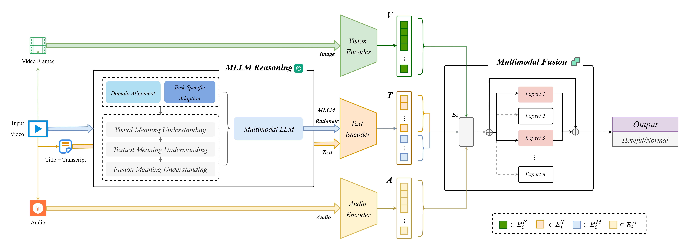

# HVGuard



HVGuard is a multimodal content safety framework that leverages **text (BERT)**, **vision (ViT)**, and **audio (Wav2Vec)** embeddings, along with reasoning from large language models (LLMs). The extracted multimodal features are cached and reused during training, enabling efficient experimentation and reproducibility.  

---

## 📂 Project Structure

- `datasets/` – Original dataset contents.  
  - `annotation(new).json`: Cleaned and re-transcribed annotations. 
- `embeddings/` – Cached multimodal embeddings (`.pth` files). No additional feature extraction is required during training.  
- `models/` – Saved models. 
- `HVGuard.py` – Main training and inference script.  
- `CoT.py` – CoT reasoning module script. 
- `config.jsonl` – Configuration file for experiments.  

---

## 🚀 Reproduction Guide

### Step 1. Install dependencies
Make sure you have Python ≥3.8 and install the required packages:
```bash
pip install -r requirements.txt
```

### Step 2. Quick Start (Using Cached Embeddings)
If you only want to reproduce results, you can directly predict using the pre-extracted embeddings.  
```bash
python HVGuard.py --dataset_name Multihateclip --language Chinese --num_classes 2 --mode predict
```
- Use `--mode predict` to directly reproduce results from cached embeddings.  

### step 3. Full Pipeline
If you want to reproduce results from scratch, please follow these steps:

1. Download datasets
- [HateMM](https://github.com/hate-alert/HateMM)  
- [MultiHateClip](https://github.com/Social-AI-Studio/MultiHateClip)  
Place them into the `./dataset/` folder.

2. Deploy models locally
- BERT
- ViT
- Wav2Vec
- FunASR
  
3. Preprocess datasets
``` bash
python video_slicer.py -i "./Multihateclip/Chinese/video/train" -o "./Multihateclip/Chinese/frames/train" --num_frames 32
python video_to_audio.py -i "./Multihateclip/Chinese/video/train" -o "./Multihateclip/Chinese/audio/train"
python extract_emotion.py -i "./Multihateclip/Chinese/"
```
After preprocessing, a complete `annotation(new).json` file will be generated.
4. Generate MLLM rationale with CoT
```bash
python CoT.py --dataset_name Multihateclip --language Chinese
```
6. Extract embeddings
```bash
python audio_embedding.py
python frames_embedding.py
python text_embedding.py
```
7. Train and predict(same as Quick Start)
